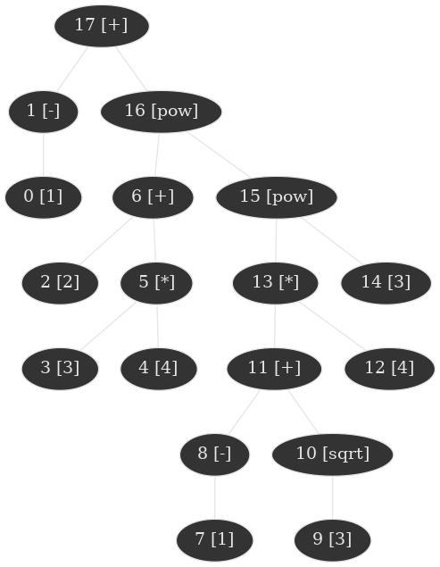
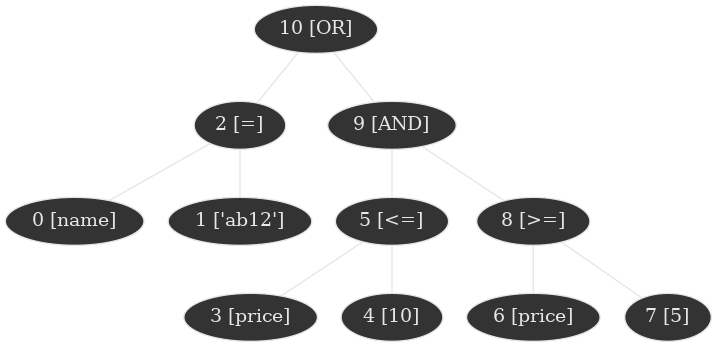

# 🌲 go-syntax-tree


[](https://github.com/bramca/go-syntax-tree/actions/workflows/test.yaml)
[](https://github.com/bramca/go-syntax-tree/releases)

This package provides a way to construct a simple [Syntax Tree](https://en.wikipedia.org/wiki/Abstract_syntax_tree) for a certain `query` based on predefined `Operators` and `Functions` with there mutual priority. For operator precedence parsing it uses the [Pratt parser](https://en.wikipedia.org/wiki/Operator-precedence_parser#Pratt_parsing) algorithm.

After parsing and constructing the tree from a given `query` string, the `SyntaxTree` will consist of a **Root** `Node`. This one acts as a starting point to go over the tree in pre-, in- or post-order (ref: [Tree Traversal](https://en.wikipedia.org/wiki/Tree_traversal)).
It will also contain a list of all `Nodes` in the `SyntaxTree`.

There is a `.String()` function that will print the `SyntaxTree` in [dot](https://graphviz.org/doc/info/lang.html) file syntax.
This can be used to write the `SyntaxTree` to a `.dot` file that can be parsed to an **image** to visualize the tree. (eg. `dot -Tpng tree.dot -o tree.png`)

## 📋 Example

```go
import (
	"os"
	"fmt"

	syntaxtree "github.com/bramca/go-syntax-tree"
)

func main() {
	mathLexer := &syntaxtree.Lexer{
		BinaryOperators: []string{
			"*",
			"/",
			"+",
			"-",
		},
		UnaryOperators: []string{
			"-",
		},
		BinaryFunctions: []string{
			"pow",
		},
		UnaryFunctions: []string{
			"sqrt",
		},
		OpenDelimiter:             '(',
		CloseDelimiter:            ')',
		BinaryFunctionOpSeparator: ',',
	}

	mathTree := syntaxtree.SyntaxTree{
		Lexer: mathLexer,
		Precendence: map[string]int{
			"+": 1,
			"-": 1,
			"*": 2,
			"/": 2,
		},
	}

	err := mathTree.BuildTree("-1+pow(2+3*4,pow((-1+sqrt(3))*4,3))")
	if err != nil {
		fmt.Printf("err: %s\n", err)
		os.Exit(1)
	}

	sqlLexer := &syntaxtree.Lexer{
		BinaryOperators: []string{
			"AND",
			"OR",
			"=",
			"!=",
			"<",
			"<=",
			">",
			">=",
		},
		OpenDelimiter:   '(',
		CloseDelimiter:  ')',
		StringDelimiter: '\'',
		TokenSeparator:  ' ',
	}

	sqlTree := syntaxtree.SyntaxTree{
		Lexer: sqlLexer,
		Precendence: map[string]int{
			"OR":  1,
			"AND": 2,
			"=":   3,
			"!=":  3,
			"<":   3,
			"<=":  3,
			">":   3,
			">=":  3,
		},
	}

	err = sqlTree.BuildTree("name = 'ab12' OR price <= 10 AND price >= 5")
	if err != nil {
		fmt.Printf("err: %s\n", err)
		os.Exit(1)
	}

	fmt.Printf("Math Tree (dotfile format):\n%s\n", mathTree)
	fmt.Printf("SQL Tree (dotfile format):\n%s\n", sqlTree)
}

```

will result in the following trees:

| Math Tree                               | SQL Tree                              |
|-----------------------------------------|---------------------------------------|
|  |  |


## 🗺️ Roadmap

- [X] Use Pratt parser algorithm
- [X] Parse unary operators
- [ ] Parse right associativity
- [ ] Parse postfix expressions
