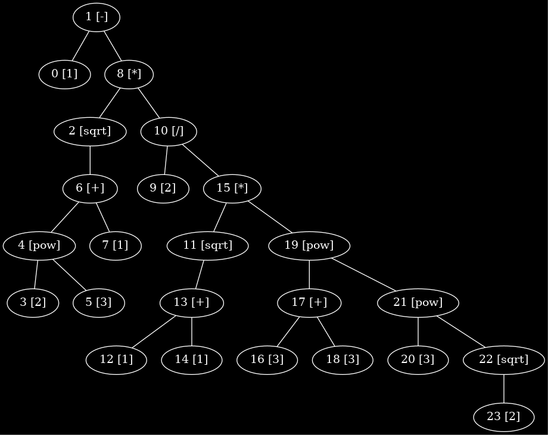

# 🌲 go-syntax-tree

[](https://github.com/bramca/go-syntax-tree/actions/workflows/test.yaml)

This package provides a way to construct a simple [Syntax Tree](https://en.wikipedia.org/wiki/Abstract_syntax_tree) for a certain `query` based on predefined `Operators` and `Functions` with there mutual priority. It will also parse and take into account grouping using `()` in the operator precedence.

After parsing and constructing the tree from a given `query` string, the `SyntaxTree` will consist of a **Root** `Node`. This one acts as a starting point to go over the tree in pre-, in- or post-order (ref: [Tree Traversal](https://en.wikipedia.org/wiki/Tree_traversal)).
It will also contain a list of all `Nodes` in the `SyntaxTree`.

There is a `.String()` function that will print the `SyntaxTree` in [dot](https://graphviz.org/doc/info/lang.html) file syntax.
This can be used to write the `SyntaxTree` to a `.dot` file that can be parsed to an **image** to visualize the tree. (eg. `❯ dot -Tpng tree.dot > tree.png`)

## 📋 Example

```go
import (
	"fmt"
	"regexp"

	syntaxtree "github.com/bramca/go-syntax-tree"
)

func firstExample() {
	query := "1-sqrt(pow(2,3)+1)*2/(sqrt(1+1)*pow(3+3,pow(3,sqrt(2))))"
	operatorsPrecedence := []string{
		"pow",
		"sqrt",
		"/",
		"*",
		"+",
		"-",
	}

	operators := []string{
		"*",
		"/",
		"+",
		"-",
	}

	binaryFunctions := []string{
		"pow",
	}

	binaryFunctionParsers := make([]syntaxtree.BinaryFunctionParser, len(binaryFunctions))
	for i, binaryFunction := range binaryFunctions {
		binaryFunctionParsers[i] = syntaxtree.BinaryFunctionParser{
			FunctionName:     binaryFunction,
			OpeningDelimiter: '(',
			ClosingDelimiter: ')',
			OperandSeparator: ',',
		}
	}

	unaryFunctions := []string{
		"sqrt",
	}

	unaryFunctionParsers :=  make([]syntaxtree.UnaryFunctionParser, len(unaryFunctions))
	for i, unaryFunction := range unaryFunctions {
		unaryFunctionParsers[i] = syntaxtree.UnaryFunctionParser{
			FunctionName:     unaryFunction,
			OpeningDelimiter: '(',
			ClosingDelimiter: ')',
		}
	}

	operatorParsers := make([]syntaxtree.OperatorParser, len(operators))
	for i, operator := range operators {
		operatorParsers[i] = syntaxtree.OperatorParser{
			OperatorString:  operator,
			OperatorPattern: regexp.MustCompile(fmt.Sprintf(`([\d\(\)]*)\%s([\d\(\)]*|pow|sqrt)`, operator)),
		}
	}

	syntaxTree := syntaxtree.SyntaxTree{
		OperatorPrecedence: operatorsPrecedence,
		OperatorParsers: operatorParsers,
		BinaryFunctionParsers: binaryFunctionParsers,
		UnaryFunctionParsers: unaryFunctionParsers,
		Separator: ";",
	}

    err := syntaxTree.ConstructTree(query)
    if err != nil {
		panic(fmt.Sprintf("Could not construct tree for query '%s': %s\n", query, err))
    }

    fmt.Printf("%s", &syntaxTree)
}
```

will result in the following tree:

